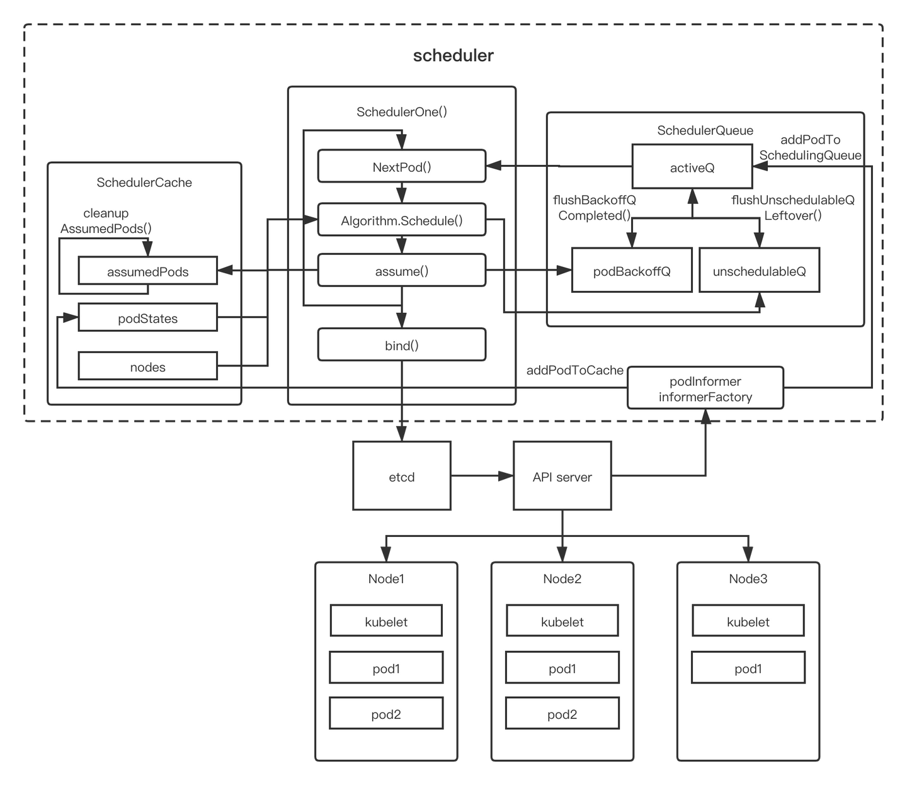

K8sスケジューラのアーキテクチャ

+--  

スケジューラーはまず、PodやNodeなどのObjectionに対してList/Watchを行います。

次に、Informerに基づいて、またスケジュラルしていないのPodをPodQueueに入れます、これはスケジュールを待ちのQueue

そして、必要なNode情報などのInformationを迅速に取れるようにするため、スケジューラーCacheを構築します。

その後、スケジューラーはsched.scheduleOne　Method　を中心にPodのスケジューリングを処理し始めます

Pod のスケジューリング選択には２つのStepが含まれます：

--+  preselection  algorithm

--+  Priorities  algorithm

preselection　の段階では、プログラムはPodのスケジューリング要件を満たす全てのNodeを選び出します。

例えば、候補Nodeの利用可能なリソースがPodのリソース要求を満たせるかどうかをチェックすることで、Nodeを選択します。

preselectionの後、スケジューリング可能な全てのNodeを含むのNode　Listが得られます。

通常、このNode  listは複数のノードが含まれています。もしこのListが空の場合、そのPodはスケジューリング出来ないことを意味します。

Priorities の段階では、現在有効なスコアルールに基づいて、Node　Listの中にスケジューリング可能な全てのNodeにスコアが付けられます。

次に、スケジューラーは最も高いスコアを持つNodeにPodをスケジューリングします。最も高いスコアを持つNodeが複数ある場合、スケジューラーはその中からランダムに1つを選びます。

スケジューリング性能を向上させるために、スケジューラーは十分なスケジューリング可能なNodeを見つけた後、検索を停止します。大規模なClusterでは、この方法により一部の時間を節約できます。
